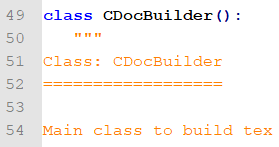
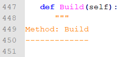
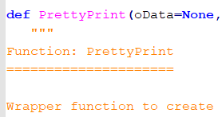
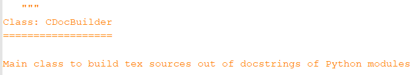
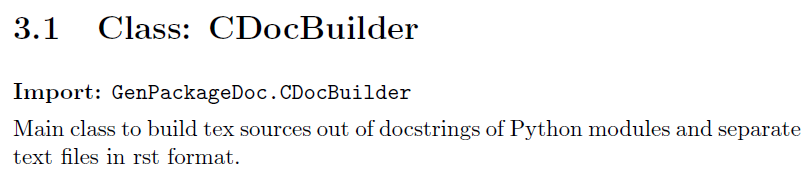
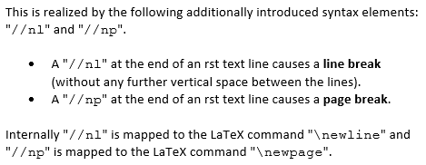

Repository content
==================

*What is the content of the repository* ``python-genpackagedoc``*?*

* Folder ``GenPackageDoc``

  Contains the package code (currently active at this position, later will be installed)

  *This folder is specific for the package.*

* Folder ``config``

  Contains the repository configuration (e.g. the name of the package, the name of the repository, the author, and more ...)

  *This folder is specific for the repository.*

* Folder ``additions``

  Contains additionally needed sources like setup related class definitions and sources, that are imported from other repositories - to make this
  repository stand alone.

* Folder ``packagedoc``

  Contains all package documentation related files, e.g. the ``GenPackageDoc`` configuration, additional input files and the generated documentation itself.

  *This folder is specific for the documentation.*

* Repository root folder

  - ``genpackagedoc.py``

    Python script to start the documentation build

  - ``dump_repository_config.py``

    Little helper to dump the repository configuration to console

Documentation build process
===========================

*How do the files and folders listed above, belong together? What is the way, the information flows when the documentation is generated?*

* The process starts with the execution of ``genpackagedoc.py`` within the repository root folder.

* ``genpackagedoc.py`` creates a repository configuration object

     ``config/CRepositoryConfig.py``

* The repository configuration object reads the static repository configuration values out of a separate json file

     ``config/repository_config.json``

* The repository configuration object adds dynamic values (like operating system specific settings and paths) to the repository configuration.
  Not all of them are required for the documentation build process, but the repository configuration also will support the setup process later.

  There is one certain setting in the repository configuration file

     ``config/repository_config.json``,

  that is essential for the documentation build process:

     ``"PACKAGEDOC" : "./packagedoc"``

  This is the path to a folder, in which all further documentation related files are placed. The path has to be relative! Reference is the position of
  ``genpackagedoc.py``. This is hard coded internally. The relative path itself can be any one.//nl
  But it is required that within this folder the configuration file for the documentation build process

     ``packagedoc_config.json``

  can be found. The name of this json file is fix!

* The configuration file ``packagedoc_config.json`` contains settings like

  * Paths to Python packages to be documented
  * Paths and names of additional rst files
  * Path and name of output folder (tex files and output PDF file)
  * User defined parameter (that can be defined here as global runtime variables and can be used in any rst code)
  * Basic settings related to the output PDF file (like document name, name of author, ...)
  * Path to LaTeX compiler//nl
    (*a LaTeX distribution is not part of* ``GenPackageDoc``)

  Be aware of that the within ``packagedoc_config.json`` specified output folder

     ``"OUTPUT" : "./build"``

  **will be deleted** at the beginning of the documentation build process! Make sure that you do not have any files
  inside this folder opened when you start the process.

  Further details are explained within the json file itself.

Now all required input and output parameter are known. After the execution of ``genpackagedoc.py`` the resulting PDF document
can be found under the specified name within the specified output folder.

PDF document structure
======================

*How is the resulting PDF document structured? What causes an entry within the table of content of the PDF document?*

In the following we use terms taken over from the LaTeX world: *chapter*, *section* and *subsection*.

A *chapter* is the top level within the PDF document; a *section* is the level below *chapter*, a *subsection* is the level below *section*.

*The following assignments happen during the generation of a PDF document:*

* The content of every additionally included separate rst file is a *chapter*.

  - In case of you want to add another chapter to your documentation, you have to include another rst file.
  - The headline of the chapter is the name of the rst file (automatically).//nl
    *Therefore the heading within an rst file has to start at section level!*

* The content of every included Python module is also a *chapter*.

  - The headline of the chapter is the name of the Python module (automatically).//nl
    This means also that within the PDF document structure every Python module is at the same level as additionally included rst files.

* Within additionally included separate rst files sections and subsections can be defined by the following rst syntax elements for headings:

  - A line underlined with "``=``" characters is a section
  - A line underlined with "``-``" characters is a subsection

* Within the docstrings of Python modules the same rst syntax elements for headings can be used to add functions, classes and methods to the table of content:

  - A line underlined with "``=``" characters is a section and should be used for classes and functions//nl
    (both classes and functions are assumed to be at the same level).

  - A line underlined with "``-``" characters is a subsection and should be used for methods of a class.

  The rst syntax provides more types of headings than "``=``" and "``-``" - but ``GenPackageDoc`` does not consider them for the table of content.

  This means: **Further nestings of headings are not supported** (because we do not want to overload the table of content).

Examples
========

Example 1: rst file
-------------------

The text of this chapter is taken over from an rst file named ``Description.rst``.

This rst file contains the following headlines:

::

   Repository content
   ==================

   Documentation build process
   ===========================

   PDF document structure
   ======================

   Examples
   ========

   Example 1: rst file
   -------------------

   Example 2: Python module
   ------------------------

Because ``Description.rst`` is the second imported rst file, the chapter number is 2. The chapter headline is "Description" (the name of the rst file).
The top level headlines *within* the rst file are at *section* level. The fourth section (Examples) contains two subsections.

The outcome is the following part of the table of content:

.. image:: ./pictures/TOC01.png

Example 2: Python module
------------------------

Part of this documentation is a Python module with name ``CDocBuilder.py``.

Because of the content of every module is a chapter, this module causes the follwing entry in the table of content:

.. image:: ./pictures/TOC02.png

The module ``CDocBuilder.py`` contains a class with name ``CDocBuilder`` (listed in table of content at *section* level).

The class ``CDocBuilder`` contains a method with name ``Build`` (listed in table of content at *subsection* level).

To create these entries within the table of content the docstring of the class contains the following heading (lines 51 and 52):

And the docstring of the method contains this heading (lines 449 and 450):

Here within the docstrings the same rst syntax ("``=``" for headings of sections, "``-``" for headings of subsections) have to be used like in rst files.

It is also possible that a Python module does not only contain classes together with their methods, but functions also. A function is something
different than a class, but it is assumed that within the code they are placed at the same level (section). The outcome is that within the docstring
a function name has to be underlined with "``=``" (same as for classes).

Example: Docstring of a function ``PrettyPrint`` within Python module ``CUtils``:

Please keep in mind: The headings ("``=``" and "``-``") do not indicate directly a function, a class or a method.
They indicate a level within the PDF document structure.

The author of the documentation has to decide which part of the code belongs to which level.

Interface descriptions
======================

*How to describe an interface of a function or a method?*

To have a unique look and feel of all interface descriptions the following style is recommended:

**Example**

.. image:: ./pictures/Interface01.png

The interface description consists of the following parts:

* Line 11: Keyword "``Function:``" followed by the name of the function.
* Line 12: Underlines "=" indicating a headline at *section* level.
* *Alternatively* in case of a class method in lines 14 and 15 the keyword "``Method:``" followed by the name of the method.
* Following line(s): common description of the function or method.
* Line 19: Keyword "``Arguments:``" indicating that in next lines all input parameters are described (in case of there are ones).
* Line 21: The name of an input parameter.
* Line 23: Some details of the input parameter.
* Following line(s): common description of the input parameter.
* Line 27: Keyword "``Returns:``"  indicating that in next lines all return parameters are described (in case of there are ones).
* Following lines: same structure like in "``Arguments:``".

Some of the special characters used within the interface description, are part of the rst syntax. They will be explained within the next section.//nl

**Important to know about Python and rst is:**

* In both Python and rst the indentation of text is part of the syntax!
* The indentation of the triple quotes indicating the beginning and the end of a docstring has to follow the Python syntax rules.
* The indentation of the content of the docstring (= the interface description in rst format) has to follow the rst syntax rules.
  To avoid a needless indentation of the text within the resulting PDF document it is recommended to start the docstring text
  within the first column (or rather use the first column as reference for further indentations of rst text).
* In rst also blank lines are part of the syntax!

*Please be attentive while typing your documentation in rst format!*//nl

**Also relevant:**

To have keywords like ``Function:``, ``Class:`` or ``Method:`` available as part of a headline makes the content of a PDF document
easy to capture for a reader:

.. image:: ./pictures/Bookmarks01.png

But they are not required, **except the keyword** "``Class:``"**!** This keyword is required!

The reason is that ``GenPackageDoc`` needs to identify the position between the headline and the following description - to have a chance
to add automatically generated content at exactly this position. In case of classes this mechanism is used to add the import path for this class.
And this automatism prevents the developer from maintaining this information manually for every class.

**Example:**

This is the docstring (extract):

And this is the corresponding PDF document content:

The "``Import:``" line is added automatically.//np

Runtime variables
=================

*What are "runtime variables" and how to use them in rst text?*

All configuration parameters of ``GenPackageDoc`` are taken out of three sources:

1. the static repository configuration

   ``config/repository_config.json``

2. the dynamic repository configuration

   ``config/CRepositoryConfig.py``

3. the static ``GenPackageDoc`` configuration

   ``packagedoc/packagedoc_config.json``

Some of them are runtime variables and can be accessed within rst text (within docstrings of Python modules and also within separate rst files).

This means it is possible to add configuration values automatically to the documentation.

This happens by encapsulating the runtime variable name in triple hashes. This "triple hash" syntax is introduced to make it easier
to distinguish between the json syntax (mostly based on curly brackets) and additional syntax elements used within values of json keys.

The name of the repository e.g. can be added to the documentation with the following rst text:

.. image:: ./pictures/RST01.png

This document contains a chapter "Appendix" at the end. This chapter is used to make the repository configuration a part of this documentation
and can be used as example.

Additionally to the predefined runtime variables a user can add own ones. See ``"PARAMS"`` within ``packagedoc_config.json``.

All predefined runtime variables are written in capital letters. To make it easier for a developer to distinguish between predefined
and user defined runtime variables, all user defined runtime variables have to be written in small letters completely.

Also the ``"DOCUMENT"`` keys within ``packagedoc_config.json`` are runtime variables.

Also within ``packagedoc_config.json`` the triple hash syntax can be used to access repository configuration values.

With this mechanism it is e.g. possible to give the output PDF document automatically the name of the package:

.. image:: ./pictures/RST02.png

Syntax extensions
=================

This feature is in an experimental phase currently! And is only available in rst files but not in docstrings.

The question is how to use rst to cause a line break or a page break in the corresponding PDF document?

RST syntax
==========

*What is rst and how to use the rst syntax elements within rst files and doctrings of Python modules?*

*(to be continued)*

