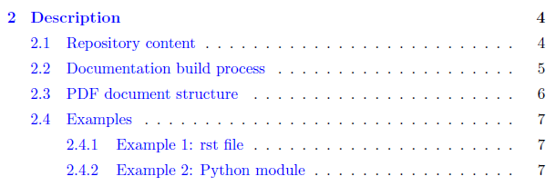
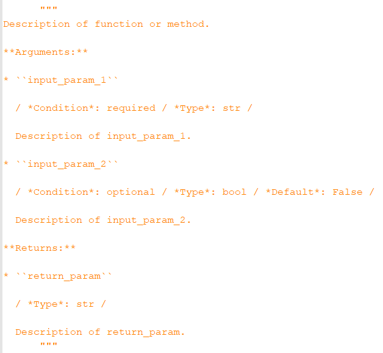

.. Copyright 2020-2022 Robert Bosch GmbH

.. Licensed under the Apache License, Version 2.0 (the "License");
   you may not use this file except in compliance with the License.
   You may obtain a copy of the License at

.. http://www.apache.org/licenses/LICENSE-2.0

.. Unless required by applicable law or agreed to in writing, software
   distributed under the License is distributed on an "AS IS" BASIS,
   WITHOUT WARRANTIES OR CONDITIONS OF ANY KIND, either express or implied.
   See the License for the specific language governing permissions and
   limitations under the License.

Repository content
==================

*What is the content of the repository* ``python-genpackagedoc``*?*

* Folder ``GenPackageDoc``

  Contains the package code.

  *This folder is specific for the package.*

* Folder ``config``

  Contains the repository configuration (e.g. the name of the package, the name of the repository, the author, and more ...).

  *This folder is specific for the repository.*

* Folder ``additions``

  Contains additionally needed sources like setup related class definitions and sources, that are imported
  from other repositories - to make this repository stand alone

* Folder ``packagedoc``

  Contains all package documentation related files, e.g. the ``GenPackageDoc`` configuration, additional input files
  and the generated documentation itself.

  *This folder is specific for the documentation.*

* Repository root folder

  - ``genpackagedoc.py``

    Python script to start the documentation build

  - ``setup.py``

    Python script to install the package sources. This includes the execution of ``genpackagedoc.py``.
    Therefore building the documentation is part of the installation process.

  - ``dump_repository_config.py``

    Little helper to dump the repository configuration to console

//

Documentation build process
===========================

*How do the files and folders listed above, belong together? What is the way, the information flows when the documentation is generated?*

* The process starts with the execution of ``genpackagedoc.py`` within the repository root folder.

  ``genpackagedoc.py`` can be used stand alone - but this script is also called by ``setup.py``. The impact is that every installation
  includes an update of the documentation.

* ``genpackagedoc.py`` creates a repository configuration object

     ``config/CRepositoryConfig.py``

* The repository configuration object reads the static repository configuration values out of a separate json file

     ``config/repository_config.json``

* The repository configuration object adds dynamic values (like operating system specific settings and paths) to the repository configuration.
  Not all of them are required for the documentation build process, but the repository configuration also supports the setup process (``setup.py``).

  There is one certain setting in the repository configuration file

     ``config/repository_config.json``,

  that is essential for the documentation build process:

     ``"PACKAGEDOC" : "./packagedoc"``

  This is the path to a folder, in which all further documentation related files are placed. In case of the path is relative, the reference
  is the position of ``genpackagedoc.py``. It is required that within this folder the configuration file for the documentation build process

     ``packagedoc_config.json``

  can be found. The name of this json file is fix!

* The configuration file ``packagedoc_config.json`` contains settings like

  * Paths to Python packages to be documented
  * Paths and names of additional rst files
  * Path and name of output folder (tex files and output PDF file)
  * User defined parameter (that can be defined here as global runtime variables and can be used in any rst code)
  * Basic settings related to the output PDF file (like document name, name of author, ...)
  * Path to LaTeX compiler/
    (*a LaTeX distribution is not part of* ``GenPackageDoc``)

  Be aware of that the within ``packagedoc_config.json`` specified output folder

     ``"OUTPUT" : "./build"``

  **will be deleted** at the beginning of the documentation build process! Make sure that you do not have any files
  inside this folder opened when you start the process. In case of the path is relative, the reference
  is the position of ``genpackagedoc.py``. The complete path is created recursively.

  **Further details are explained within the json file itself.**

* ``genpackagedoc.py`` also creates an own configuration object

     ``GenPackageDoc/CPackageDocConfig.py``

  ``CPackageDocConfig.py`` takes over all repository configuration values, reads in the static ``GenPackageDoc``
  configuration (``packagedoc_config.json``) and adds dynamically computed values like the full absolute paths
  belonging to the documentation build process. Also all command line parameters are resolved and checked.

  The reference for all relative paths is the position of ``genpackagedoc.py`` (that is the repository root folder).

After the execution of ``genpackagedoc.py`` the resulting PDF document can be found under the specified name
within the specified output folder (``"OUTPUT"``). This folder also contains all temporary files generated during the
documentation build process. 

Because the output folder is a temporary one, the PDF document is copied to the folder containing the package sources
and therefore is included in the package installation. This is defined in the ``GenPackageDoc`` configuration, section ``"PDFDEST"``./

/

**Command line**

Some configuration parameter predefined within ``packagedoc_config.json``, can be overwritten in command line.

``--output``

  Path and name of folder containing all output files.

``--pdfdest``

  Path and name of folder in which the generated PDF file will be copied to (after this file has been created within the output folder).

  *Caution*: The generated PDF file will per default be copied to the package folder within the repository. This is defined in ``packagedoc_config.json``.
  The version of the PDF file within the package folder will be part of the installation (when using ``setup.py``). When you change the PDF destination,
  then you get this file at another location - but this file will not be part of the installation any more. Installed will be the version,
  that is still present within the package folder of the repository. Please try to get the bottom of your motivation when you change this setting.

``--configdest``

  Path and name of folder in which a dump of the current configuration will be copied to.

  The configuration dump is part of the build output (section 'OUTPUT') and available in txt and in json format.
  It might be useful for further processes to have access to all details regarding the current
  documentation build.

--strict

  If ``True``, a missing LaTeX compiler aborts the process, otherwise the process continues.

--simulateonly

  If ``True``, the LaTeX compiler is switched off. No new PDF output will be generated. Already existing PDF output will not be updated.
  This is not handled as error and also not handled as warning. Only the source files will be parsed. This switch is useful
  to do a pre check for possible syntax issues within the source files without spending time for rendering PDF files.

**Example**

.. Code::python

   genpackagedoc.py --output="../any/other/location" --pdfdest="../any/other/location" --configdest="../any/other/location" --strict=True

All listed parameters are optional. GenPackageDoc creates the complete output path (``--output``) recursively. Other destination folder
(``--pdfdest`` and ``--configdest``) have to exist already.

//

PDF document structure
======================

*How is the resulting PDF document structured? What causes an entry within the table of content of the PDF document?*

In the following we use terms taken over from the LaTeX world: *chapter*, *section* and *subsection*.

A *chapter* is the top level within the PDF document; a *section* is the level below *chapter*, a *subsection* is the level below *section*.

*The following assignments happen during the generation of a PDF document:*

* The content of every additionally included separate rst file is a *chapter*.

  - In case of you want to add another chapter to your documentation, you have to include another rst file.
  - The headline of the chapter is the name of the rst file (automatically)./
    *Therefore the heading within an rst file has to start at section level!*

* The content of every included Python module is also a *chapter*.

  - The headline of the chapter is the name of the Python module (automatically)./
    This means also that within the PDF document structure every Python module is at the same level as additionally included rst files.

* Within additionally included separate rst files sections and subsections can be defined by the following rst syntax elements for headings:

  - A line underlined with "``=``" characters is a section
  - A line underlined with "``-``" characters is a subsection

* Within the docstrings of Python modules the headings are added automatically (for functions, classes and methods)

  - Classes and functions are listed at section level (both classes and functions are assumed to be at the same level).
  - Class methods are listed at subesction level.

  **Further nestings of headings are not supported** (because we do not want to overload the table of content).

//

Examples
========

Example 1: rst file
-------------------

The text of this chapter is taken over from an rst file named ``Description.rst``.

This rst file contains the following headlines:

::

   Repository content
   ==================

   Documentation build process
   ===========================

   PDF document structure
   ======================

   Examples
   ========

   Example 1: rst file
   -------------------

   Example 2: Python module
   ------------------------

Because ``Description.rst`` is the second imported rst file, the chapter number is 2. The chapter headline is "Description" (the name of the rst file).
The top level headlines *within* the rst file are at *section* level. The fourth section (Examples) contains two subsections.

The outcome is the following part of the table of content:

Example 2: Python module
------------------------

Part of this documentation is a Python module with name ``CDocBuilder.py`` (listed in table of content at *chapter* level).
This module contains a class with name ``CDocBuilder`` (listed in table of content at *section* level).
The class ``CDocBuilder`` contains a method with name ``Build`` (listed in table of content at *subsection* level).

This causes the following entry within the table of contents:

//

Interface and module descriptions
=================================

*How to describe an interface of a function or a method? How to describe a Python module?*

To have a unique look and feel of all interface descriptions, the following style is recommended:

**Example**

Some of the special characters used within the interface description, are part of the rst syntax. They will be explained in one of the next sections.

The docstrings containing the description, have to be placed directly in the next line after the ``def`` or ``class`` statement.

It is also possible to place a docstring at the top of a Python module. The exact position doesn't matter - but it has to be the
first constant expression within the code. Within the documentation the content of this docstring is placed before the interface description
and should contain general information belonging to the entire module.

The usage of such a docstring is an option.

//

Runtime variables
=================

*What are "runtime variables" and how to use them in rst text?*

All configuration parameters of ``GenPackageDoc`` are taken out of four sources:

1. the static repository configuration

   ``config/repository_config.json``

2. the dynamic repository configuration

   ``config/CRepositoryConfig.py``

3. the static ``GenPackageDoc`` configuration

   ``packagedoc/packagedoc_config.json``

4. the dynamic ``GenPackageDoc`` configuration

   ``GenPackageDoc/CPackageDocConfig.py``

Some of them are runtime variables and can be accessed within rst text (within docstrings of Python modules and also within separate rst files).

This means it is possible to add configuration values automatically to the documentation.

This happens by encapsulating the runtime variable name in triple hashes. This "triple hash" syntax is introduced to make it easier
to distinguish between the json syntax (mostly based on curly brackets) and additional syntax elements used within values of json keys.

The name of the repository e.g. can be added to the documentation with the following rst text:

This document contains a chapter "Appendix" at the end. This chapter is used to make the repository configuration a part of this documentation
and can be used as example.

Additionally to the predefined runtime variables a user can add own ones./
See ``"PARAMS"`` within ``packagedoc_config.json``.

All predefined runtime variables are written in capital letters. To make it easier for a developer to distinguish between predefined
and user defined runtime variables, all user defined runtime variables have to be written in small letters completely.

Also the ``"DOCUMENT"`` keys within ``packagedoc_config.json`` are runtime variables.

Also within ``packagedoc_config.json`` the triple hash syntax can be used to access repository configuration values.

With this mechanism it is e.g. possible to give the output PDF document automatically the name of the package:

.. image:: ./pictures/RST02.png

//

Syntax aspects
==============

Common rules
------------

**Important to know about the syntax of Python and rst is:**

* In both Python and rst the indentation of text is part of the syntax!
* The indentation of the triple quotes indicating the beginning and the end of a docstring has to follow the Python syntax rules.
* The indentation of the content of the docstring (= the interface description in rst format) has to follow the rst syntax rules.
  To avoid a needless indentation of the text within the resulting PDF document and to avoid further unwanted side effects caused by
  improper indentations, it is strongly required to start at least the first line of a docstring text within the first column!
  And this first line is the reference for the indentation of further lines of the current docstring. The indentation of these further
  lines depends on the rst syntax element that is used here.
* In rst also blank lines are part of the syntax!

*Why is a proper indentation of the docstrings so much important?*

The contents of all doctrings of a Python module will be merged to one single rst document (internally by GenPackageDoc). In this
single rst document we do not have separated docstring lines any more. We have one text! And we have a relationship between previous
lines and following lines in this text. The indentation of these previous and following lines must fit together – accordingly
to the rst syntax rules. Otherwise we either get syntax issues during computation or we get text with a layout that does not fit
to our expectation.

*Please be attentive while typing your documentation in rst format!*/

Syntax extensions
-----------------

``GenPackageDoc`` extends the rst syntax by the following topics:

* *newline*

  A newline (line break) is realized by a slash ('``/``') at the end of a line containing any other rst text
  (this means: the slash must **not** be the only character in line)./
  Internally this slash is mapped to the LaTeX command ``\newline``.

* *vspace*

  An additional vertical space (size: the height of the '``x``' character - depending on the current type and size of font)
  is realized by a single slash ('``/``'). This slash must be the only character in line!/
  Internally this slash is mapped to the LaTeX command ``\vspace{1ex}``.

* *newpage*

  A newpage (page break) is realized by a double slash ('``//``'). These two slashes must be the only characters in line!/
  Internally this double slash is mapped to the LaTeX command ``\newpage``.

These syntax extensions can currently be used in separate rst files only and are not available within docstrings of Python modules.

