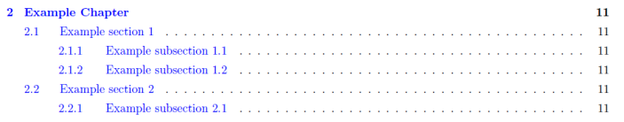
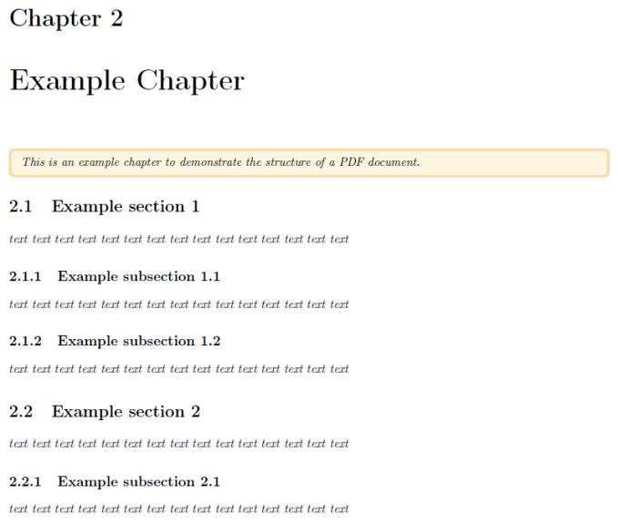
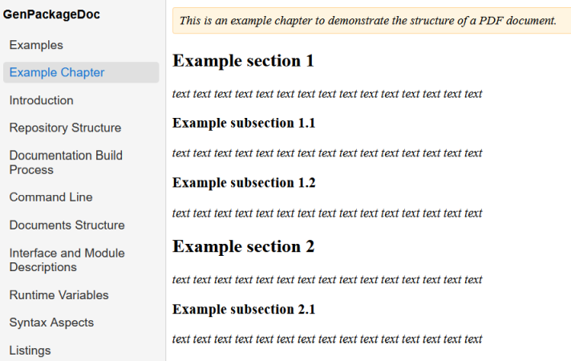
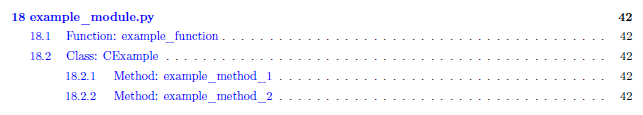
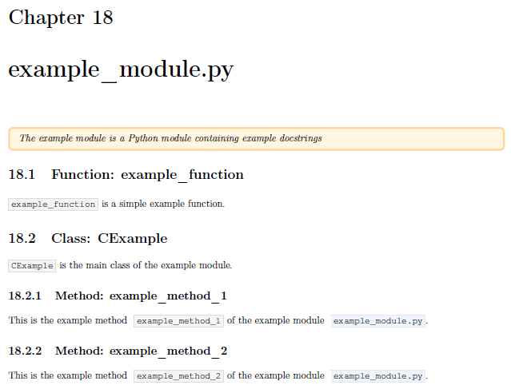

.. Copyright 2020-2026 Robert Bosch GmbH

.. Licensed under the Apache License, Version 2.0 (the "License");
   you may not use this file except in compliance with the License.
   You may obtain a copy of the License at

.. http://www.apache.org/licenses/LICENSE-2.0

.. Unless required by applicable law or agreed to in writing, software
   distributed under the License is distributed on an "AS IS" BASIS,
   WITHOUT WARRANTIES OR CONDITIONS OF ANY KIND, either express or implied.
   See the License for the specific language governing permissions and
   limitations under the License.

.. highlight::

   How are the generated documents structured? What causes an entry within the table of content and how does the table of content look like?

In the following we use terms taken over from the LaTeX world: *chapter*, *section* and *subsection*.

A *chapter* is the top level within the PDF document; a *section* is the level below *chapter*, a *subsection* is the level below *section*./VVS

*The following assignments happen during the generation of a PDF document:*

* The content of every additionally included separate reST file is a *chapter*.

  - In case of you want to add another chapter to your documentation, you have to include another reST file.
  - The headline of the chapter is the name of the reST file (automatically)./NL
    *Therefore, it is not necessary to repeat the headline inside the file.*

* The content of every included Python module is also a *chapter*.

  - The headline of the chapter is the name of the Python module (automatically)./NL
    This means also that within the PDF document structure every Python module is at the same level as additionally included reST files.

* Within additionally included separate reST files sections and subsections can be defined by the usual reST syntax elements for headings:

  - A line underlined with ":acontent:`=`"
  - A line underlined with ":acontent:`-`"

* Within the docstrings of Python modules the headings are added automatically (for functions, classes and methods)

  - Classes and functions are listed at section level (both classes and functions are assumed to be at the same level).
  - Class methods are listed at subesction level.

  **Further nestings of headings are not supported** (because we do not want to overload the table of content).

/NP

Example: reST file
==================

This can be the content of a file :fsystem:`Example Chapter.rst` in reST format:

.. anycontent::

   .. highlight::

      This is an example chapter to demonstrate the structure of a PDF document.

   Example section 1
   =================

   *text text text text text text text text text text text text text text text*

   Example subsection 1.1
   ----------------------

   *text text text text text text text text text text text text text text text*

   Example subsection 1.2
   ----------------------

   *text text text text text text text text text text text text text text text*

   Example section 2
   =================

   *text text text text text text text text text text text text text text text*

   Example subsection 2.1
   ----------------------

   *text text text text text text text text text text text text text text text*

In PDF this causes an entry in the table of content:/VVS

/NP
And this is the content itself:/VVS

/NP
The table of contents of the documentation in HTML format is currently limited to the top level (*chapters*):/VVS

/NP

Example: Python module
======================

This can be the content of some docstrings within a Python module :fsystem:`example_module.py`:

.. pythoncode::

   """
   .. highlight::

      The example module is a Python module containing example docstrings
   """

   def example_function():
      """
   :acontent:`example_function` is a simple example function.
      """

   class CExample():
      """
   :acontent:`CExample` is the main class of the example module.
      """

      def example_method_1(self):
         """
   This is the example method :acontent:`example_method_1` of the example module :fsystem:`example_module.py`.
         """
         pass

      def example_method_2(self):
         """
   This is the example method :acontent:`example_method_2` of the example module :fsystem:`example_module.py`.
         """
         pass

/VVS
In PDF this causes an entry in the table of content:/VVS

/NP
And this is the content itself:/VVS

The name of the Python module is placed at *chapter* level. The names of functions and classes are placed at *section* level.
The names of class methods are placed at *subsection* level.

**Caution: Headings within docstrings of Python module are not supported! Nested function definitions are skipped also.**

The table of contents of the documentation in HTML format is currently limited to the top level (that is the name of the Python module).
The functions classes and methods are not yet included in the HTML table of content.

/NP

