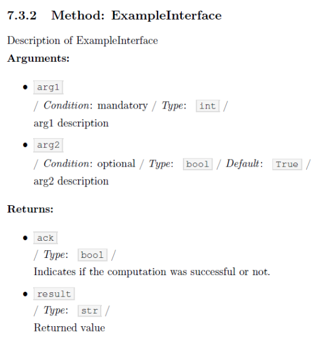

.. Copyright 2020-2026 Robert Bosch GmbH

.. Licensed under the Apache License, Version 2.0 (the "License");
   you may not use this file except in compliance with the License.
   You may obtain a copy of the License at

.. http://www.apache.org/licenses/LICENSE-2.0

.. Unless required by applicable law or agreed to in writing, software
   distributed under the License is distributed on an "AS IS" BASIS,
   WITHOUT WARRANTIES OR CONDITIONS OF ANY KIND, either express or implied.
   See the License for the specific language governing permissions and
   limitations under the License.

.. highlight::

   How to describe an interface of a function or a method? How to describe a Python module?

To have a unique look and feel of all interface descriptions, the following style is recommended:/VVS

**Example**/VS

.. image:: ./pictures/interface01.png

/NP
Within the rendered documents this interface description looks like this:/VS

The docstrings containing the description, have to be placed directly in the next line after the :acontent:`def` or :acontent:`class` statement.

It is also possible to place a docstring at the top of a Python module. The exact position doesn't matter - but it has to be the
first constant expression within the code. Within the documentation the content of this docstring is placed before the interface description
and should contain general information belonging to the entire module.

The usage of such a docstring is an option.

/NP
