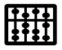

Introduction part 1
===================

part 1 part 1 part 1 part 1 part 1 part 1 part 1 part 1 part 1 part 1 part 1 part 1 part 1 part 1 part 1 part 1 part 1 part 1 part 1 part 1 part 1 part 1

Introduction part 1 a
---------------------

part 1 a part 1 a part 1 a part 1 a part 1 a part 1 a part 1 a part 1 a part 1 a part 1 a part 1 a part 1 a part 1 a part 1 a part 1 a part 1 a part 1 a 

Introduction part 1 b
---------------------

part 1 b part 1 b part 1 b part 1 b part 1 b part 1 b part 1 b part 1 b part 1 b part 1 b part 1 b part 1 b part 1 b part 1 b part 1 b part 1 b part 1 b 

Introduction part 2
===================

part 2 part 2 part 2 part 2 part 2 part 2 part 2 part 2 part 2 part 2 part 2 part 2 part 2 part 2 part 2 part 2 part 2 part 2 part 2 part 2 part 2 part 2

Introduction part 2 a
---------------------

part 2 a part 2 a part 2 a part 2 a part 2 a part 2 a part 2 a part 2 a part 2 a part 2 a part 2 a part 2 a part 2 a part 2 a part 2 a part 2 a part 2 a 

Introduction part 2 b
---------------------

part 2 b part 2 b part 2 b part 2 b part 2 b part 2 b part 2 b part 2 b part 2 b part 2 b part 2 b part 2 b part 2 b part 2 b part 2 b part 2 b part 2 b 

