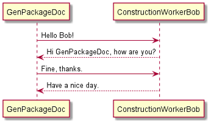
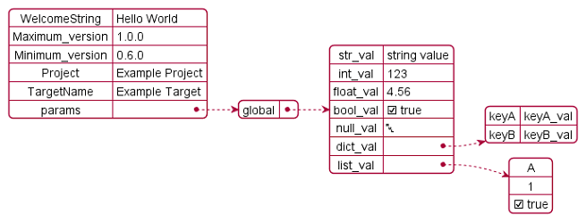

.. Copyright 2020-2026 Robert Bosch GmbH

.. Licensed under the Apache License, Version 2.0 (the "License");
   you may not use this file except in compliance with the License.
   You may obtain a copy of the License at

.. http://www.apache.org/licenses/LICENSE-2.0

.. Unless required by applicable law or agreed to in writing, software
   distributed under the License is distributed on an "AS IS" BASIS,
   WITHOUT WARRANTIES OR CONDITIONS OF ANY KIND, either express or implied.
   See the License for the specific language governing permissions and
   limitations under the License.

.. highlight::

   How to import pictures?
   How to render and import diagrams?

Pictures Import
---------------

Pictures can be imported in the following way:

1. Import in reST content:

   .. anycontent::

      .. image:: ./pictures/AnyPicture.png

2. Import in LaTeX content:

   .. anycontent::

      \includegraphics[scale=0.7]{./pictures/AnyPicture.png}

The user needs to adapt the scaling to make the rendered diagrams fit to a page of a PDF document in best way.
But this scaling only works in LaTeX code, but not in reST code.

/VVS

Diagrams Rendering and Import
-----------------------------

A *diagram* in this context is a picture that is rendered out of source code. **GenPackageDoc** supports **PlantUML** that supports a wide range of diagrams.

To use the **PlantUML** functionality with **GenPackageDoc**, some preconditions have to be fulfilled:

1. **PlantUML** is installed (either as stand-alone installation or as VSCodium extension)
2. **GenPackageDoc** is configured (:fsystem:`packagedoc_config.json`):

   a. In section :acontent:`"DIAGRAMS"` a path to a diagrams folder is defined (containing the diagrams source code).
   b. In section :acontent:`"JAVA"` path and name of the java interpreter is defined (because **PlantUML** is a java application).
   c. In section :acontent:`"PLANT_UML"` path and name of the **PlantUML** application is defined.

All **PlantUML** source code files within the :acontent:`"DIAGRAMS"` folder need to have the extension :fsystem:`puml`./NP

Example: Sequence diagram
---------------------------

The following code of a :fsystem:`puml` file produces a sequence diagram:

.. anycontent::

   @startuml
   GenPackageDoc -> ConstructionWorkerBob: Hello Bob!
   ConstructionWorkerBob --> GenPackageDoc: Hi GenPackageDoc, how are you?
   GenPackageDoc -> ConstructionWorkerBob: Fine, thanks.
   ConstructionWorkerBob --> GenPackageDoc: Have a nice day.
   @enduml

Result:

/NP

Example: JSON diagram
---------------------

The following code of a :fsystem:`puml` file produces a sequence diagram:

.. jsoncode::

   @startjson
   {
     "WelcomeString"   : "Hello World",

     "Maximum_version" : "1.0.0",
     "Minimum_version" : "0.6.0",

     "Project"         : "Example Project",
     "TargetName"      : "Example Target",

     "params" : {
                  "global" : {
                               "str_val"   : "string value",
                               "int_val"   : 123,
                               "float_val" : 4.56,
                               "bool_val"  : true,
                               "null_val"  : null,
                               "dict_val"  : {"keyA" : "keyA_val", "keyB" : "keyB_val"},
                               "list_val"  : ["A", 1, true]}
                 }
   }
   @endjson

Result:

/VVS
In case of **PlantUML** is configured in the **GenPackageDoc** configuration and in case of :fsystem:`puml` files are available within the diagrams folder,
**GenPackageDoc** automatically calls **PlantUML** to render the diagrams. They can be imported in the following way:

1. Import in reST content:

   .. anycontent::

      .. image:: ./diagrams/SequenceDiagram.png

2. Import in LaTeX content:

   .. anycontent::

      \includegraphics[scale=0.7]{./diagrams/SequenceDiagram.png}
