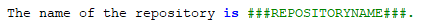
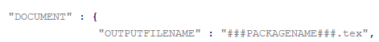

.. Copyright 2020-2026 Robert Bosch GmbH

.. Licensed under the Apache License, Version 2.0 (the "License");
   you may not use this file except in compliance with the License.
   You may obtain a copy of the License at

.. http://www.apache.org/licenses/LICENSE-2.0

.. Unless required by applicable law or agreed to in writing, software
   distributed under the License is distributed on an "AS IS" BASIS,
   WITHOUT WARRANTIES OR CONDITIONS OF ANY KIND, either express or implied.
   See the License for the specific language governing permissions and
   limitations under the License.

.. highlight::

   What are "runtime variables" and how to use them in reST content?

All configuration parameters of **GenPackageDoc** are taken out of four sources:

1. the static repository configuration

   :fsystem:`pyproject.toml`

2. the dynamic repository configuration

   :fsystem:`config/CRepositoryConfig.py`

3. the static **GenPackageDoc** configuration

   :fsystem:`packagedoc/packagedoc_config.json`

4. the dynamic **GenPackageDoc** configuration

   :fsystem:`GenPackageDoc/CPackageDocConfig.py`

Some of them are runtime variables and can be accessed within reST content (within docstrings of Python modules and also within separate reST files).

This means it is possible to add configuration values automatically to the documentation.

This happens by encapsulating the runtime variable name in triple hashes. This "triple hash" syntax is introduced to make it easier
to distinguish between the json syntax (mostly based on curly brackets) and additional syntax elements used within values of json keys.

The name of the repository e.g. can be added to the documentation with the following reST content:

This document contains a chapter "Appendix" at the end. This chapter is used to make the repository configuration a part of this documentation
and can be used as example.

Additionally to the predefined runtime variables a user can add own ones./NL
See :acontent:`"PARAMS"` within :fsystem:`packagedoc_config.json`.

All predefined runtime variables are written in capital letters. To make it easier for a developer to distinguish between predefined
and user defined runtime variables, all user defined runtime variables have to be written in small letters completely.

Also the :acontent:`"DOCUMENT"` keys within :fsystem:`packagedoc_config.json` are runtime variables.

Also within :fsystem:`packagedoc_config.json` the triple hash syntax can be used to access repository configuration values.

With this mechanism it is e.g. possible to give the output PDF document automatically the name of the package:

/NP
