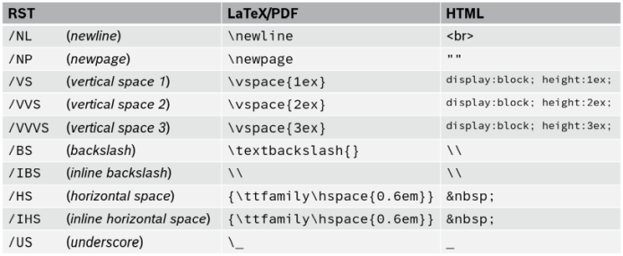
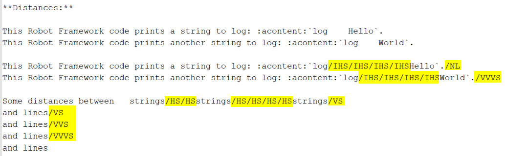
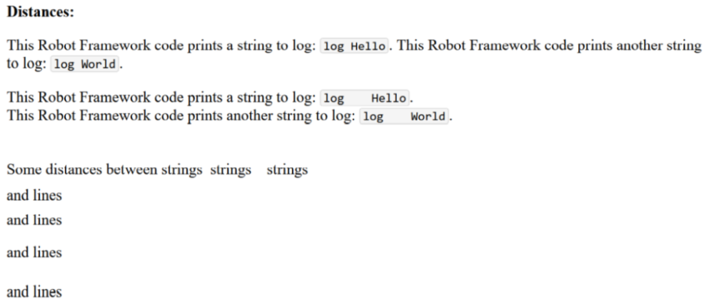
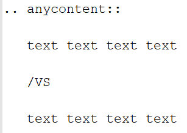
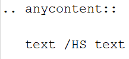

.. Copyright 2020-2026 Robert Bosch GmbH

.. Licensed under the Apache License, Version 2.0 (the "License");
   you may not use this file except in compliance with the License.
   You may obtain a copy of the License at

.. http://www.apache.org/licenses/LICENSE-2.0

.. Unless required by applicable law or agreed to in writing, software
   distributed under the License is distributed on an "AS IS" BASIS,
   WITHOUT WARRANTIES OR CONDITIONS OF ANY KIND, either express or implied.
   See the License for the specific language governing permissions and
   limitations under the License.

.. highlight::

   What specific syntax rules must be observed when writing separate documents and the docstrings of Python modules in reST format?

Common rules
------------

**Important to know about the syntax of Python and reST is:**

* In both Python and reST the indentation of text is part of the syntax!
* The indentation of the triple quotes indicating the beginning and the end of a docstring has to follow the Python syntax rules.
* The indentation of the content of the docstring (= the interface description in reST format) has to follow the reST syntax rules.
  To avoid a needless indentation of the text within the resulting PDF document and to avoid further unwanted side effects caused by
  improper indentations, it is strongly required to start at least the first line of a docstring text within the first column!
  And this first line is the reference for the indentation of further lines of the current docstring. The indentation of these further
  lines depends on the reST syntax element that is used here.
* In reSTreST also blank lines are part of the syntax!

*Why is a proper indentation of the docstrings so much important?*

The contents of all doctrings of a Python module will be merged to one single reST document (internally by **GenPackageDoc**). In this
single reST document we do not have separated docstring lines any more. We have one text! And we have a relationship between previous
lines and following lines in this text. The indentation of these previous and following lines must fit together – accordingly
to the reST syntax rules. Otherwise we either get syntax issues during computation or we get text with a layout that does not fit
to our expectation.

/NP

Syntax extensions
-----------------

Like mentioned above, **GenPackageDoc** converts the documentation content from reST format to LaTeX format and to HTML format.
Every format defines its own special characters as part of the syntax. For example: *underscores* in reST, *backslashes*
in LaTeX and horizontal and vertical distances in HTML.

It is not possible, with acceptable effort, to use all special characters directly as literals in reST in such a way
that they are displayed as literals in both LaTeX and HTML. The differences between the involved formats and the resulting
requirements for escaping are simply too great. To enable the use of these special characters nonetheless, **GenPackageDoc**
provides its own syntax elements. This allows **GenPackageDoc** to handle these special cases specifically for each output format.

Every syntax element starts with a slash, followed by an abbreviation in capital letters.

The following syntax elements are available:/VVS

/VVVS
The following example demonstrates how the syntax extensions work:/VS

/NP
Output in HTML format:/VS

/VVS
**Insights:**

* A line break in editor does not cause a line break in output files.
* A line break in output files must be set explicitly by :acontent:`/\NL` (= *newline*) at the end of a line.
* Without additional measures, multiple spaces in standard text and in inline literals are each reduced to a single space.
* A space that is to be preserved is defined by :acontent:`/\HS` (= *horizontal space*) in standard text and by
  :acontent:`/\IHS` (= *inline horizontal space*) in inline literals.
* Additional to the possibility to use blank lines for vertical distances in standard text, several *vertical space*
  elements (:acontent:`/\VS`, :acontent:`/\VVS`, :acontent:`/\VVVS`) are available to define vertical distances
  in higher granularity.
* User defined vertical distances are not possible in inline literals (and makes no sense here).

**Recommendations:**

Like shown in the example above, the usage of syntax elements should follow these rules:

* Prefer to put the syntax element for a line break at the end of the line - and
  combine this with a line break of the text in editor. This eases the readability of the text.
* Prefer to put syntax elements for vertical distances at the end of a line.
* Prefer to put syntax elements for horizontal distances immediately between strings inside a line.

**Reasons:**

This would increase the vertical distance between lines caused by additional blank lines:

/NP
This would increase the horizontal distance between two strings within a line by additional blanks:

This style should be avoided (but is for sure not forbidden)./VVS

In block literals (e.g. like :acontent:`anycontent`), the extended syntax is not allowed - and not necesary.
The content is printed out **as is** (*without any interpretation*)./VVS

**Hint:** It is good practise to put a :acontent:`/\NP` at the end of each section. Every following section will
start at a new page in PDF output (in HTML output, :acontent:`/\NP` has no effect).

/NP

